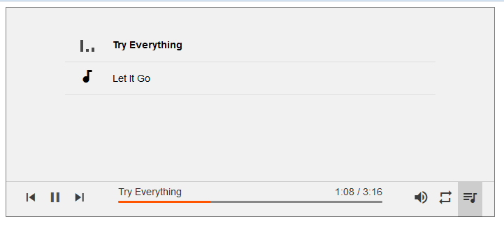

# html5-audio-player

## 1. introduce
html5 audio player(with playlist) using flexbox, svg, css animations and  js api.

forked from @k-ivan at http://codepen.io/k-ivan/pen/pJMLmJ

demo: [html5-audio-player](https://likev.github.io/html5-audio-player/ 'html5-audio-player demo')



## 2. how to use
1. insert Google Material Icons and AudioPlayer.css before `</head>`
2. insert AudioPlayer.js before `</body>`
3. use AP.init function

code example:
```html
<!DOCTYPE html>
<html >
  <head>
    <meta charset="UTF-8">
    <title>Audio player HTML5</title>
    <meta name="viewport" content="width=device-width, initial-scale=1">

    <link href="https://fonts.googleapis.com/icon?family=Material+Icons" rel="stylesheet">
    <link rel="stylesheet" href="css/AudioPlayer.css">
    <style>

    #player{
        position: relative;
        max-width: 700px;
        height: 500px;
        border: solid 1px gray;
    }
    </style>
  </head>

  <body>
      <!-- Audio player container-->
     <div id='player'></div>

    <!-- Audio player js begin-->
    <script src="js/AudioPlayer.js"></script>

    <script>
        // test image for web notifications
        var iconImage = null;

        AP.init({
            container:'#player',//a string containing one CSS selector
            volume   : 0.7,
            autoPlay : true,
            notification: false,
            playList: [
                {'icon': iconImage, 'title': 'Try Everything', 'file': 'mp3/try-everything.mp3'},
                {'icon': iconImage, 'title': 'Let It Go', 'file': 'mp3/let-it-go.mp3'}
          ]
        });
    </script>
    <!-- Audio player js end-->

  </body>
</html>
```

it will work!
